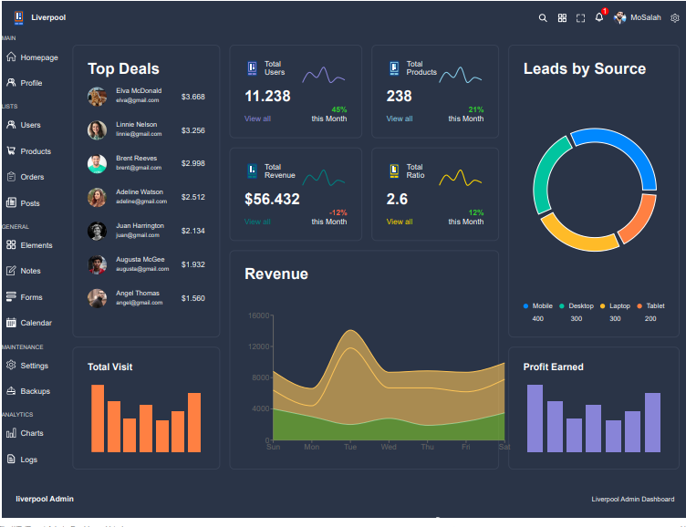

# React Admin Dashboard

A clean and modern React Admin Dashboard built using React.js, React Router, and Material UI. This project aims to provide a user-friendly interface for managing and visualizing data in a responsive and efficient manner.

## Features

- Interactive and intuitive UI design.
- Seamless navigation using React Router.
- Utilizes Material UI components for a polished look and feel.
- Responsive layout ensuring compatibility across all devices.
- Data visualization using various charts powered by React Charts.

## Installation

1. Clone the repository: `git clone https://github.com/username/react-admin-dashboard.git`
2. Navigate to the project directory: `cd react-admin-dashboard`
3. Install dependencies: `npm install`

## Usage

1. Run the development server: `npm start`
2. Open your browser and go to: `http://localhost:3000`

 Contributions are welcome!
